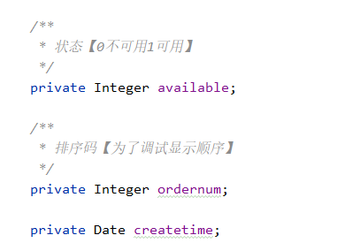
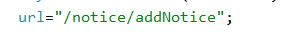

# README

## 1.环境配置

### 1.环境要求：

JDK1.8、MYSQL8、Maven3.6.3+

进入菜单的默认账号为：

账号：system

密码：123456

数据库里的密码看起来有点奇怪，这是因为进行了1次md5加密。

技术选型：前端使用layui，后端使用springboot+maven+mybatis-plus

技术参考：https://www.bilibili.com/video/BV1UJ411T7w2?p=1

现有的都是学他的。
现在已完成的模块：公告模块、部门模块、登录信息模块。

### 2.导入数据

在mysql中运行/dumps文件夹下的最新sql，向数据库中导入数据

### 3.修改环境

1.application.yml

将这两处修改为自己MYSQL数据库的账号和密码

2.CodeGenerator_MIS

修改以下配置配置，方便之后生成代码。

此处改为本地项目的地址。

此处更改为本地MYSQL的账号密码。

3.给IDEA装一个Lombok插件，解决getter/setter飘红的问题

## 2.快速开始

目标：完成某个表的增删查改

### 1.后端选取好表，进行代码生成

此处开发规范：

与系统功能相关的，归入sys模块，与业务功能有关的，归入bus模块。

例：

### 2.代码生成完毕后，需要修改才能使用

1.在entity/中，生成的表中若有日期数据，要将自动生成的LocalDateTime改为Date：

如：

修改前：

修改后：

（导入包时选用java.util)

2.移动mapper文件：

生成的mapper映射会出现在mapper/xml/ ，而我们要将其移动到/resources/mappper/[模块名]下。

如：

修改前：

修改后：

### 3.做查询功能

以notice（公告管理）为例子，做一个会分页的查询

####1.创建NoticeVo

noticeVo可以用来体现查询条件与限定初始显示的页面情况。

例子中是现实第一页，每页10条。ids是选中情况

#### 2.修改controller，写查询逻辑

其中DataGridView其实就是查询所得结果，querywarpper就是包装查询语句。

#### 3.前端写下页面表格

noticeManager.html

放在templates目录下。

使用layui表格组件初始化数据表：

这个页面大部分东西都可以复用。

#### 4.写系统控制器

####5.修改菜单地址

在数据库中的sys_permission里，添加/修改你的菜单地址，以接口形式表示。

#### 6.启动应用查看有无bug

启动MedMISApplication，访问localhost:8088

### 4.做添加功能

#### 1.修改Controller

其中，createtime、user、opername都是后端增加的，从前端传来的数据只有content。

如果只想保存前端传来的数据，使用this.noticeService.saveOrUpdate(noticeVo)即可。

#### 2.增加前端的接口

其中，url为数据提交的接口。

如：

###5.做删除和批量删除功能

#### 1.前端接口

把id传过去。

如果是批量删除：

传一个列表。详情见noticeManager.html

#### 2.修改Controller

直接调用removebyId即可。

若是批量删除：

组合成列表后，调用removebyIds

### 6.做更新功能

#### 1.前端接口

和增加一样，只不过url改为：

#### 2.修改Controller

同样，接收到了id就进行修改即可。

### 6.不会写querywarpper怎么办？

mybatis支持使用SQL来查询数据库，写一个mapper interface的方法，然后通过@Select（"一条sql"）的注解定义这个方法如何查询数据库，写好mapper的方法后通过service层的套娃，在controller调用service层的套娃方法。插入和删除也可以，注解具体写法请自行探索。

例子参考mapper/PermissionMapper的getMenu方法。

### 7.接口错误处理
controller的返回值除了返回template中的视图资源，还可以返回实体对象或者数据传输对象。

如果只需要返回成功或者失败的信息，你可以偷懒使用ResultObj对象，前端在请求成功的方法里处理请求失败的情况，但是不建议这样做。

推荐的做法是通过JAVA的异常处理。在可能请求失败的地方捕获并抛出异常，抛出异常统一使用medMISException，需要填入异常信息和Httpstatus，然后前端根据Httpstatus是否为200来处理接口的请求。

例子参考controler/LoginController和templates/index/login.html。

### 8.设置接口权限

TODO

## 3.一些规范

### 1.代码格式

建议给IDEA安装Google-Java-Format和Save-Actions插件，在保存时自动格式化代码，使代码更美观

IDEA必须安装lombok插件 否则会报错

### 2.增加新功能与改bug

增加新功能时，请新建分支feature/【功能名】，修改bug时，请新建分支hotfix/【修改内容】。内容用-分隔，如feature/user-login。

写好代码后pull一下master分支，在本地处理冲突，调试完成后再push。最后merge到master上，不确定写得有没有问题可以@一个伙伴检查一下再合并。

### 3.获得当前用户的信息

除了getSession(),还有getRequest()方法可以获得ip等信息，示例见LoginController。

### 4.命名

1. 请使用驼峰命名
2. 接口的url需要加上api/作为前缀，资源和路由的url则不需要
2. 需要保存在sys_permission表的资源使用toXxxYyy的命名格式，普通路径则不需要

### 5.开发前端页面直接去layui找样式

或者参考已有的界面。不懂得用的就去开头的b站视频那里选一个章节看一下。

建议跟着那个b站视频看几期，比如公告管理那几p
### 6.尽量不要出现常数

常数统一集合在/common/contrast，返回的集中在/common/ResultObj